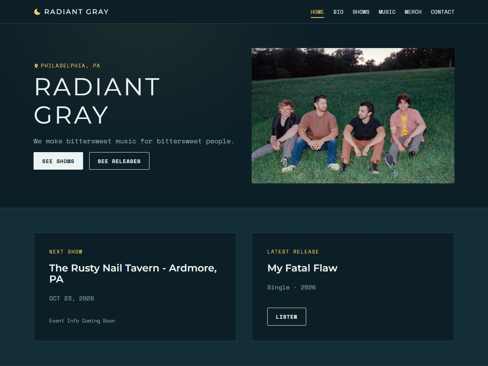

# Radiant Gray

Website for Radiant Gray, a Philadelphia emo/shoegaze band:
**[radiantgrayband.com](https://radiantgrayband.com)**



A static, mobile-friendly band site (Home, Bio, Shows, Music, Merch, Contact)
that the band can update without touching code.

## Features

- Shows page that sorts itself into Upcoming and Past by date
- Music page with per-release streaming/Bandcamp links
- Home page with next-show and latest-release cards, an embedded latest
  video, and social links
- Contact form
- Content-managed: shows, releases, members, photos and site text are edited
  through a CMS rather than in code
- Responsive layout, custom dark theme built on CSS variables

## Stack

React 19, Vite, React Router, plain CSS, Decap CMS, Netlify

## Running locally

```bash
npm install
npm run dev      # http://localhost:5173
```

```bash
npm run build    # production build into dist/
npm run preview  # serve the production build locally
npm run lint     # oxlint
```

## Structure

```
public/           static assets (images, CMS config, host config files)
src/
  components/     Navbar, Footer, SocialLinks, icons
  pages/          Home, Bio, Shows, Music, Merch, Contact, NotFound
  content/        site content as JSON
  data/           thin layer over content/ that pages import from
  hooks/          usePageTitle
  utils/          date, slug and YouTube URL helpers
  styles/         global.css (design tokens and base styles)
```

## Content

All site content lives in `src/content/*.json` (`site`, `shows`, `releases`,
`members`, `merch`). Pages read it through the modules in `src/data/`, which
document each field.

Theme colors, fonts and spacing are CSS variables at the top of
`src/styles/global.css`.

## Deployment

Built with `npm run build` and published from `dist/` on Netlify.
